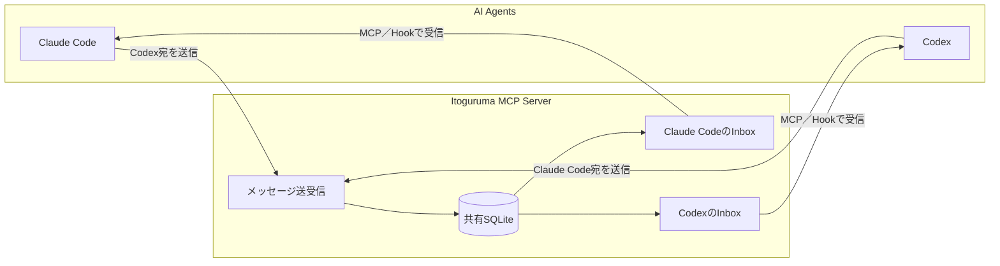

# Itoguruma

Claude Code、Codexなどの独立したAIエージェント間で、SQLiteを正本としてメッセージを交換する常駐型MCP Streamable HTTPサーバーです。

## ユースケース



Claude CodeとCodexは送信側・受信側のどちらにもなれます。送信されたメッセージは共有SQLiteへ保存され、宛先AgentのInboxに並びます。受信側はMCP ToolまたはライフサイクルHookでInboxの新着を受け取ります。相手が停止中でもメッセージは消えず、次回のInbox確認時に配信されます。

## 配布物

GitHub Releasesでは、利用目的ごとに配布物を分けます。

| 配布物 | 対象 | .NET 8 SDK |
| :--- | :--- | :---: |
| `Install-Itoguruma.ps1` | 通常利用者向けインストーラ | 不要 |
| `Itoguruma-x.x.x-win-x64.zip` | 手動配置・オフライン利用向けself-containedバイナリ | 不要 |
| `Source code (zip/tar.gz)` | 開発者向けソース配布 | 必要 |

コマンドの詳細は[COMMANDS.md](COMMANDS.md)、Claude Code／Codex Hookの導入手順は[HOOKS.md](HOOKS.md)を参照してください。

## インストーラ版

GitHub Releasesから`Install-Itoguruma.ps1`をダウンロードし、PowerShellで実行します。

```powershell
powershell -ExecutionPolicy Bypass -File .\Install-Itoguruma.ps1
```

インストーラは次の処理を行います。

- 最新のWindows x64バイナリZIPを取得
- `%LOCALAPPDATA%\Programs\Itoguruma`へ配置
- `%LOCALAPPDATA%\Programs\Itoguruma\data\messages.db`を共有DBとして準備
- `itoguruma`、`stop-codex`、`stop-claude`をユーザーPATHへ登録
- インストール済みのCodexとClaude Codeへ`itoguruma` MCPを登録
- localhost限定HTTPサーバーを起動し、ユーザー単位のスケジュールタスクへ登録
- 読み取り専用メッセージビューワーを配置

完了後、新しいターミナルを開き、CodexとClaude Codeを再起動してください。既存のDBは上書き・削除しません。インストーラのオプションは[コマンド一覧](COMMANDS.md#インストーラオプション)を参照してください。

## バイナリZIP版

`Itoguruma-x.x.x-win-x64.zip`を任意のディレクトリへ展開します。ZIPは.NETランタイムを同梱するため、.NET 8 SDKは不要です。

```text
bin/
├─ server/Itoguruma.Server.exe
├─ itoguruma/itoguruma.exe
├─ viewer/itoguruma-viewer.exe
├─ stop-codex/stop-codex.exe
└─ stop-claude/stop-claude.exe
examples/claude-settings.json
examples/codex-hooks.json
README.md
COMMANDS.md
```

手動登録では、認証トークン、DB、待受URLをユーザー環境変数へ設定してサーバーを起動します。

```powershell
$env:ITOGURUMA_AUTH_TOKEN = "<十分に長いランダム値>"
$env:ITOGURUMA_DB = "<install>\data\messages.db"
$env:ITOGURUMA_URL = "http://127.0.0.1:47631"
$env:ITOGURUMA_CONFIG_DIR = "<install>\config"
$env:ITOGURUMA_LOG_DIR = "<install>\logs"
Start-Process "<install>\bin\server\Itoguruma.Server.exe" -WindowStyle Hidden
codex mcp add itoguruma --url "http://127.0.0.1:47631/mcp" --bearer-token-env-var ITOGURUMA_AUTH_TOKEN
claude mcp add --transport http --scope user --header "Authorization: Bearer $env:ITOGURUMA_AUTH_TOKEN" itoguruma "http://127.0.0.1:47631/mcp"
```

`Itoguruma.Server`はURL単位およびDB単位の名前付きMutexで多重起動を拒否します。スケジュールタスクはログオン時に起動し、異常終了時は最大3回再起動します。MCPエンドポイントはBearer認証を必須とし、Originがある場合はloopbackだけを許可します。

## ソース版

ソースからビルドする開発者だけが.NET 8 SDKを必要とします。

```powershell
dotnet restore tests/Itoguruma.Tests/Itoguruma.Tests.csproj
dotnet build tests/Itoguruma.Tests/Itoguruma.Tests.csproj -c Release --no-restore
dotnet test tests/Itoguruma.Tests/Itoguruma.Tests.csproj -c Release --no-build
```

配布物をローカル生成する場合:

```powershell
.\scripts\Build-Release.ps1 -Version 0.3.1
```

正式なReleaseはGitHub Actionsの`Release`を手動実行し、`version`へ`0.3.5`または`v0.3.5`形式で指定します。ワークフローは常に`main`をチェックアウトし、ビルドとテストの成功後にタグとGitHub Releaseを作成します。手元からReleaseタグをpushしないでください。設計意図は[ADR 0002](docs/adr/0002-release-from-main-workflow-dispatch.md)を参照してください。

## 初期設定と往復確認

```powershell
itoguruma register --agent claude-main --type claude-code
itoguruma register --agent codex-main --type codex
itoguruma send --from claude-main --to codex-main --thread setup-check --body "疎通確認" --idempotency-key setup-check-1
itoguruma inbox --agent codex-main --lease-seconds 300
itoguruma ack --agent codex-main --message <messageId>
```

各セッションからMCP Toolを使う場合も、最初に`register_agent`を呼び出します。受信処理が完了したメッセージは必ずACKしてください。ACK前に受信側が停止した場合、lease期限後に再配送されます。送信再試行では同じ`idempotency_key`を使用してください。

Hookを使う場合は、インストーラが生成する`examples/claude-settings.json`または`examples/codex-hooks.json`を既存設定へ統合します。設定場所、Hookごとの動作、ACK、疎通確認は[Hook設定ガイド](HOOKS.md)を参照してください。

## メッセージビューワー

`itoguruma-viewer.exe`は共有SQLiteを読み取り専用で監視するWindows GUIです。インストーラ版では次から起動できます。

```powershell
& "$env:LOCALAPPDATA\Programs\Itoguruma\bin\viewer\itoguruma-viewer.exe"
```

Codex本体と関連プロセスを強制終了する場合は`stop-codex`を使用します。実行前に対象だけを確認できます。

```powershell
stop-codex --list
stop-codex
```

Claude CodeとClaudeデスクトップ本体を強制終了する場合は`stop-claude`を使用します。

```powershell
stop-claude --list
stop-claude
```

ビューワーでは、メッセージの送信元・宛先・thread・本文、`pending`／`leased`／`acked`の配送状態、lease期限、ACK時刻を確認できます。状態・Agent・キーワードで絞り込みでき、既定では2秒間隔で自動更新します。DBを更新せず、メッセージをleaseまたはACKしません。別のDBを開く場合は画面上部の「参照」または第1コマンドライン引数で指定します。

## 主な機能

- append-onlyのメッセージ本文と、分離した`pending → leased → acked`配送状態
- lease期限切れによるat-least-once再配送
- sender単位の`idempotency_key`による重複送信防止
- WAL、FULL同期、外部キー、5秒のbusy timeout
- thread、reply-to、複数宛先
- Claude Code／Codex Hookから利用できる`itoguruma` CLI

MCP Streamable HTTP → `MessagingService` → `IMessageStore` → `SqliteMessageStore`の順に分離しています。ビューワーもUI → `IMessageMonitor` → `SqliteMessageMonitor`としてSQLiteアクセスを分離しています。Idle状態のAgentを起こすSupervisor、Task/Project管理、Broadcast、全文検索、Web UIは対象外です。
